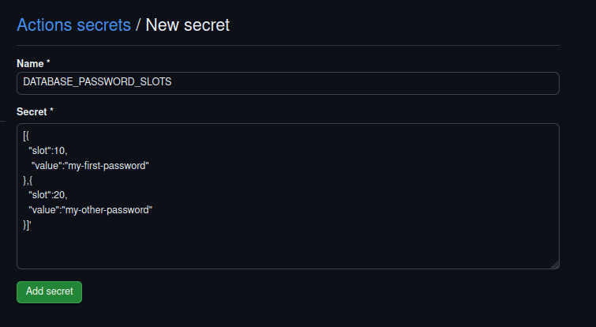

⏮️ Back to main [README.md](../README.md)

# Secrets Action

## Usage

> [!IMPORTANT]
>
> A Gcore
> [permanent API token](https://gcore.com/docs/account-settings/create-use-or-delete-a-permanent-api-token)
> is required to authorize access to the Gcore API.

```yaml
name: Deploy

on:
  workflow_dispatch:

jobs:
  deploy:
    name: deploy
    runs-on: ubuntu-latest

    steps:
      - id: deploy-secret
        uses: gcore-github-actions/fastedge/secrets@v1
        with:
          api_key: ${{ secrets.GCORE_API_TOKEN }}
          secret_name: 'my-new-secret'
          secret_value: 'my-new-secret-value'
          comment:
            'Creates a basic secret that can then be used in applications'

      - name: Use output
        run: |
          echo "secret_id: ${{ steps.deploy-secret.outputs.secret_id }}"
```

> [!NOTE]
>
> This action runs using Node 20. If you are using self-hosted GitHub Actions
> runners, you must use a [runner version](https://github.com/actions/runner)
> that supports this version or newer.

## Inputs

- `api_key` - (required) A permanent API token that will authenticate the GitHub
  action to Gcore API.
- `secret_name` - (required) The unique name of the secret.

- `secret_value` - (optional) The value of the secret, will default to ( slot: 0
  ).
- `secret_id` - (optional) The unique ID of the secret, when using this you are
  able to edit the name via the action.
- `comment` - (optional) The description of the secret.
- `secret_slots` - (optional) A JSON string representing a secret_slots array.
- `api_url` - (optional) Defaults to https://api.gcore.com

#### Usage: (`secret_value` vs `secret_slots`)

If you provide both, `secret_slots` will take precedence.

`secret_value` is purely a simple method of creating a valid `secret_slots`
array from simple input.

e.g.

```yaml
secret_value: hello-world
```

will produce and insert a `secret_slots` array on your behalf:

```json
[{ "slot": 0, "value": "hello-world" }]
```

Managing more complex `secret_slots` data, it is recommended to provide them as
repository secrets.

e.g.

```yaml
secrets_slots: ${{ secrets.DATABASE_PASSWORD_SLOTS }}
```



## Outputs

- `secret_id`: The unique ID allocated to the secret.

## CI/CD Runtime

> [!NOTE]
>
> This action is configured to only make updates if it detects changes.

## Development

1. Copy and rename `.env.example.secrets` >> `.env.secrets`.
2. Edit this`.env.secrets` file with your `API_KEY` and other values you wish to
   use.
3. Run `npm run local-action:secret` after any change to test it using the
   `test-local-action` workflow.

> [!NOTE]
>
> Remember to call `npm run all` before committing your changes and pushing them
> to remote.

## Releasing

1. Run the `./script/release` script to create and push a new tag.
1. A workflow will run and generate a new draft release for you based on the tag
   you entered.
1. Open the
   [Releases](https://github.com/gcore-github-actions/deploy-container/releases)
   page and go to the draft release.
1. Make sure the `Publish this release to the GitHub Marketplace` checkbox is
   checked and changelog is correct.
1. Publish the new release.
1. Move the major version tag (e.g. v1) to the latest patch release.
